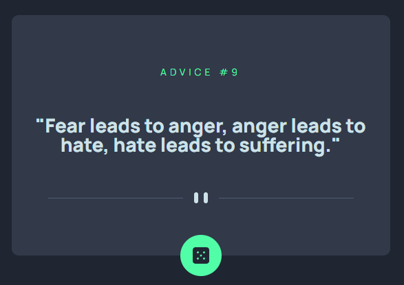
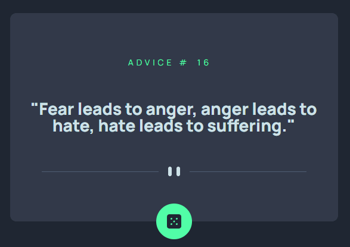

# Table of contents

- [Overview](#overview)
  - [Skills](#skills)
  - [Links](#links)
  - [Author](#author)
  - [The challenge](#the-challenge)
- [Screenshot](#screenshot)
- [My process](#my-process)
  - [What I learned](#what-i-learned)

## Overview

### Skills
- Semantic HTML5 markup
- SASS Preprocessor
- CSS animation
- Flexbox
- Javascript
- Fetch API
- Mobile-first workflow
- [Advice Slip API](https://api.adviceslip.com/)
- Git
- Netlify for deployment

### Links

- **Solution URL** - [https://github.com/jaytee-padilla/advice-generator-app](https://github.com/jaytee-padilla/advice-generator-app)
- **Live Site URL** - [https://jaytee-advice-generator.netlify.app/](https://jaytee-advice-generator.netlify.app/)

### Author

- [Jaytee Padilla](https://jayteepadilla.dev/)

### The Challenge

Users should be able to:

- View the optimal layout for the app depending on their device's screen size
- See hover states for all interactive elements on the page
- Generate a new piece of advice by clicking the dice icon

## Screenshot


## My Process

### What I Learned

- The usual `node-sass` package I use is being deprecated so I had to figure out how to setup SASS using `dart-sass` syntax

- How to remove the `node_modules` directory from the remote repo after accidentally pushing it up
```
git rm -r --cached node_modules
git commit -m "Removed node_modules"
git push origin main
```

- SASS variables usage

- Conditional rendering of SVGs based on viewport size using only HTML/CSS with high browser compatibility (REALLY old versions -- 2009 and earlier -- of Internet Explorer & Firefox don't support media queries)
```scss
#desktop-divider {
    display: none;
  }

  @media screen and (min-width: 600px) {
    width: 550px;

    #mobile-divider {
      display: none;
    }

    #desktop-divider { 
      display: block;
    }
  }
```

- How to display an element that visually sits on top of the edges of its parent container. The key was giving it a `position: relative` property and offsetting it's position by 30px from its parent
```scss
#dice-button {
  position: relative;
  bottom: 30px;
  display: flex;
  justify-content: center;
  align-items: center;
  width: 60px;
  height: 60px;
  background-color: $neon-green;
  border-radius: 100%;
}
```

- How to implement generic error handling using the Fetch API.
  - An important nuance with the Fetch API is it only [rejects a promise when a “network error is encountered, although this usually means permissions issues or similar.” Basically `fetch()` will only reject a promise if the user is offline, or some unlikely networking error occurs, such a DNS lookup failure.](https://dmitripavlutin.com/javascript-fetch-async-await/)

- Got stuck on the "Advice #000" heading shifting position before/after getting the `id` data from the `fetch()`. I fixed it using [this solution](https://stackoverflow.com/a/257564)<br/>



- How to fade out/in the text when new advice is generated (based on #2 of [this](https://stackoverflow.com/a/65658994) stackoverflow solution)
```js
fetchAdvice()
    .then(advice => {
      quoteEl.classList.add('fade-out');
      // fade out/in when a new quote is generated
      setTimeout(function () {
        quoteEl.classList.remove("fade-out");
        quoteEl.textContent = advice.slip.advice;
      }, 1000);

      adviceIdEl.textContent = advice.slip.id;
    });
```
```scss
.quote {
    font-size: 28px;
    font-weight: 800;
    opacity: 1;
    transition: 1s;
  }

.fade-out {
  opacity: 0;
  transition: 1s;
}
```

- I can't use CSS animation properties on flexbox properties (e.g. `justify-content: space-evenly`), but can use it on the `flex-growth` related properties (e.g. `flex-grow`, `flex-shrink`, `flex-basis`, and the shorthand `flex`)

# Frontend Mentor - Advice generator app solution

This is a solution to the [Advice Generator App challenge on Frontend Mentor](https://www.frontendmentor.io/challenges/advice-generator-app-QdUG-13db).
